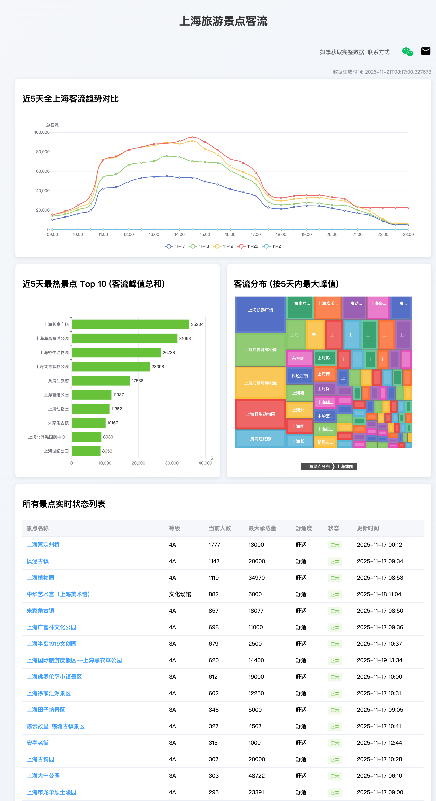
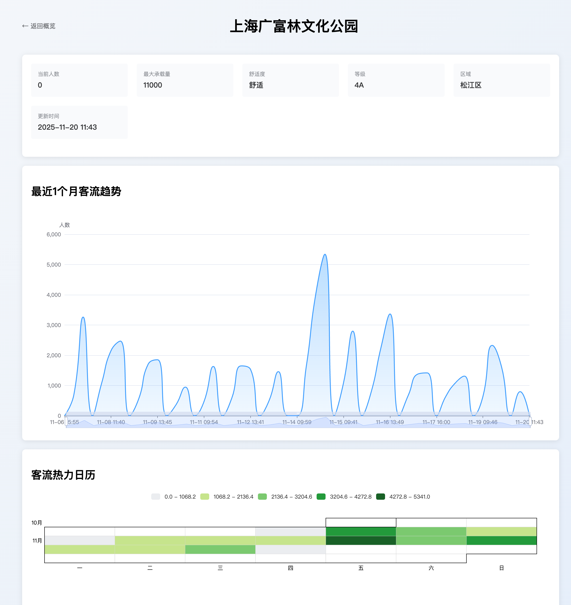

<!-- 活跃状态自动更新标记，请勿删除或手动修改 -->
当前项目在 2026-02-02 时还活跃

# 上海旅游景区实时人流数据爬虫

[](https://github.com/PPsteven/shanghai-view-tourist-realtime)
[](https://www.python.org/downloads/)
[](https://github.com/PPsteven/shanghai-view-tourist-realtime/actions/workflows/tourist-crawler.yml)

这是一个用于定时抓取上海市主要旅游景区实时人流数据的 Python 脚本，并将数据存储到阿里云 OSS 对象存储中。

## 前言
多年前实现的脚本，用于定时爬取上海景区数据，用来做人流量展示的，适合用于课堂教学使用。
由于服务器和数据库到期后就没有继续爬了，感觉比较可惜，数据连续性断了。
昨天突发奇想，用阿里云OSS(存储) + Github Actions(定时) 可以几乎很低成本的实现这个项目，快速实现了一版，后续用这种方式，持续把好用的玩具开源出来。

后续TODO:

- [x] 前端 Github Pages 实现可视化 + Github Actions(定时脚本推送)
- [x] 优化数据存储结构，使用追加写入节省OSS费用
- [x] 添加历史数据迁移工具

## 功能特性

- 🕒 **定时采集**: 每20分钟自动抓取一次数据（目前已暂停）
- 📊 **双重存储**: 支持按日期和按景点名称两种数据组织方式
- ☁️ **云端存储**: 数据直接上传至阿里云 OSS，使用追加写入节省费用
- 🛡️ **高可靠性**: 包含错误处理和重试机制
- ⚙️ **自动化部署**: 基于 GitHub Actions 实现全自动运行
- 🔄 **数据迁移**: 提供历史数据迁移工具，支持旧数据结构转换

## 技术架构

- **语言**: Python 3.9
- **核心依赖**:
  - `requests`: HTTP 请求库
  - `oss2`: 阿里云 OSS SDK
- **部署平台**: 
  - GitHub Actions（已暂停）
  - 阿里云函数计算 FC（推荐）
- **存储服务**: 阿里云对象存储 OSS
- **前端展示**: React + Vite + GitHub Pages

## 数据来源

本项目数据来源于上海市文旅局官方接口：
```
https://tourist.whlyj.sh.gov.cn/api/statistics/getViewTourist
```

## 数据结构

数据按照两种方式进行组织并存储在 OSS 中，使用 JSONL 格式（每行一个JSON对象）：

### 按日期存储
路径：`tourist_data/YYYY/MM/DD.jsonl`

每行格式：
```json
{
  "timestamp": "2025-11-07T15:42:00.000000",
  "data": {
    "code": 200,
    "msg": "success",
    "total": 5,
    "rows": [
      {
        "NAME": "外滩",
        "CODE": "WH001",
        "DISTRICT": "黄浦区",
        "TIME": "2025-11-07 15:42",
        "CURRENT_FLOW": 1234,
        "MAX_CAPACITY": 5000
      }
    ]
  }
}
```

### 按景点名称存储
路径：`tourist_data/YYYY/MM/{景点名称}.jsonl`

每行格式：
```json
{
  "timestamp": "2025-11-07T15:42:00.000000",
  "spot": {
    "NAME": "外滩",
    "CODE": "WH001", 
    "DISTRICT": "黄浦区",
    "TIME": "2025-11-07 15:42",
    "CURRENT_FLOW": 1234,
    "MAX_CAPACITY": 5000
  }
}
```

## 项目结构

```
├── tourist_crawler.py          # 主爬虫脚本（简化版）
├── tourist_crawler_fc.py       # 阿里云函数计算版本
├── migrate_oss_data.py         # OSS历史数据迁移脚本
├── requirements.txt            # Python依赖
├── .github/workflows/          # GitHub Actions工作流
│   └── tourist-crawler.yml     # 定时爬虫任务（已暂停）
└── web/                        # 前端可视化
    ├── src/                    # React源码
    ├── public/                 # 静态资源
    └── package.json            # 前端依赖
```

## 快速开始

### 环境准备

1. **安装 Python 3.9+**
2. **安装依赖包**:
   ```bash
   pip install -r requirements.txt
   ```

3. **配置环境变量**:
   复制 `.env.example` 为 `.env` 并填写以下配置项：
   ```bash
   # 阿里云 OSS 配置
   OSS_ACCESS_KEY_ID=your_access_key_id
   OSS_ACCESS_KEY_SECRET=your_access_key_secret
   OSS_ENDPOINT=oss-cn-shanghai.aliyuncs.com
   OSS_BUCKET_NAME=your_bucket_name
   ```

### 手动运行爬虫

```bash
python tourist_crawler.py
```

### 前端开发

```bash
cd web
npm install
npm run dev
```

### 自动化运行

项目支持两种自动化运行方式：

1. **GitHub Actions**（已暂停）：
   项目通过 GitHub Actions 实现每20分钟自动运行一次数据采集任务（目前已暂停）。

2. **阿里云函数计算 FC**（推荐）：
   使用 `tourist_crawler_fc.py` 脚本部署到阿里云函数计算服务，通过设置触发器实现定时执行。相比 GitHub Actions，具有更高的执行效率和更低的资源消耗。

## 核心脚本说明

### tourist_crawler.py - 主爬虫脚本

**主要特性：**
- 简化版实现，专注核心功能
- 使用 OSS 追加写入，节省存储费用
- 双重数据组织：按日期和按景点存储
- 完善的错误处理和日志输出

**数据流程：**
1. 从官方API获取实时数据
2. 按日期存储完整数据到 `tourist_data/YYYY/MM/DD.jsonl`
3. 按景点拆分数据存储到 `tourist_data/YYYY/MM/{景点名}.jsonl`
4. 使用追加写入模式，避免重复上传

### migrate_oss_data.py - 数据迁移脚本

**主要功能：**
- 扫描并识别旧格式的数据文件
- 自动解析多种旧数据格式
- 按新的存储结构重新组织数据
- 支持预览模式和实际执行模式
- 自动备份原始文件到 `_backup` 目录

**使用场景：**
- 从旧的数据结构迁移到新结构
- 数据格式标准化
- 历史数据整理和归档

**安全特性：**
- 默认预览模式，不会修改数据
- 自动备份原始文件
- 详细的操作日志和进度显示

### tourist_crawler_fc.py - 阿里云函数计算版本

**主要特性：**
- 基于阿里云函数计算（Function Compute）实现的无服务器版本
- 替代 GitHub Actions 的定时任务执行方式
- 保持与原版相同的数据处理逻辑和存储结构
- 更高的执行效率和更低的资源消耗

**部署方式：**
1. 在阿里云函数计算服务中创建新的函数
2. 上传 `tourist_crawler_fc.py` 脚本作为函数代码
3. 配置环境变量：
   - `OSS_ACCESS_KEY_ID`: 阿里云访问密钥 ID
   - `OSS_ACCESS_KEY_SECRET`: 阿里云访问密钥 Secret
   - `OSS_ENDPOINT`: OSS 服务节点地址（可选，默认为 oss-cn-shanghai.aliyuncs.com）
   - `OSS_BUCKET_NAME`: OSS 存储桶名称（可选，默认为 shanghai-tourist-traffic）
4. 设置触发器，配置定时执行规则（如每20分钟执行一次）

**优势：**
- 无需管理服务器基础设施
- 按需计费，成本更低
- 自动扩缩容，高可用性
- 与阿里云生态系统无缝集成

## 部署配置

### GitHub Secrets 配置

在仓库设置中添加以下 Secrets：
- `OSS_ACCESS_KEY_ID`: 阿里云访问密钥 ID
- `OSS_ACCESS_KEY_SECRET`: 阿里云访问密钥 Secret
- `OSS_ENDPOINT`: OSS 服务节点地址

### 环境变量说明

| 变量名 | 默认值 | 说明 |
|--------|--------|------|
| `OSS_ACCESS_KEY_ID` | - | 阿里云访问密钥 ID |
| `OSS_ACCESS_KEY_SECRET` | - | 阿里云访问密钥 Secret |
| `OSS_ENDPOINT` | oss-cn-shanghai.aliyuncs.com | OSS 服务节点地址 |
| `OSS_BUCKET_NAME` | shanghai-tourist-traffic | OSS 存储桶名称 |

## 本地开发

### 安装依赖
```bash
pip install -r requirements.txt
```

### 运行测试
```bash
python tourist_crawler.py
```

## 成本优化

### OSS 存储费用优化
- 使用追加写入（Append Object）而非普通上传
- 减少API调用次数，降低请求费用
- JSONL格式存储，便于流式处理

### GitHub Actions 优化
- 合理设置运行频率（每20分钟）
- 使用缓存加速依赖安装
- 环境变量统一管理

## 数据分析建议

### 数据访问模式
```python
# 按日期读取数据
import json
with open('tourist_data/2025/11/07.jsonl', 'r') as f:
    for line in f:
        record = json.loads(line)
        # 处理每条记录

# 按景点读取数据  
with open('tourist_data/2025/11/外滩.jsonl', 'r') as f:
    for line in f:
        record = json.loads(line)
        # 处理景点数据
```

### 推荐分析工具
- **Pandas**: 数据处理和分析
- **Matplotlib/Plotly**: 数据可视化
- **Jupyter Notebook**: 交互式分析

## 注意事项

1. 请确保阿里云 OSS 相关权限配置正确
2. 不要将敏感信息提交到代码仓库中
3. 建议定期检查 OSS 存储空间使用情况
5. 追加写入模式下，文件一旦创建就无法修改，只能追加

## 常见问题

### Q: 为什么使用追加写入而不是普通上传？
A: 追加写入可以显著降低OSS的API调用费用，特别适合频繁写入小量数据的场景。

### Q: 前端页面无法显示数据怎么办？
A: 检查 `web/public/data/` 目录下是否有最新的数据文件，以及GitHub Pages是否正常部署。

## License

本项目采用 MIT 许可证，详情请见 [LICENSE](LICENSE) 文件。

## 贡献

欢迎提交 Issue 和 Pull Request 来改进这个项目！

## 更新日志

- **v2.0** (2025-11): 
  - 重构为简化版爬虫
  - 添加数据迁移工具
  - 优化存储结构，使用追加写入
  - 完善前端可视化
- **v1.0** (2023): 初始版本，基础爬虫功能

## 预览截图

### 主页预览


### 详情页预览

